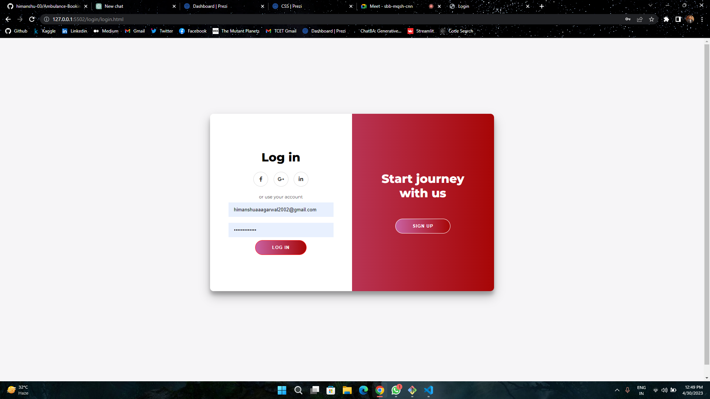
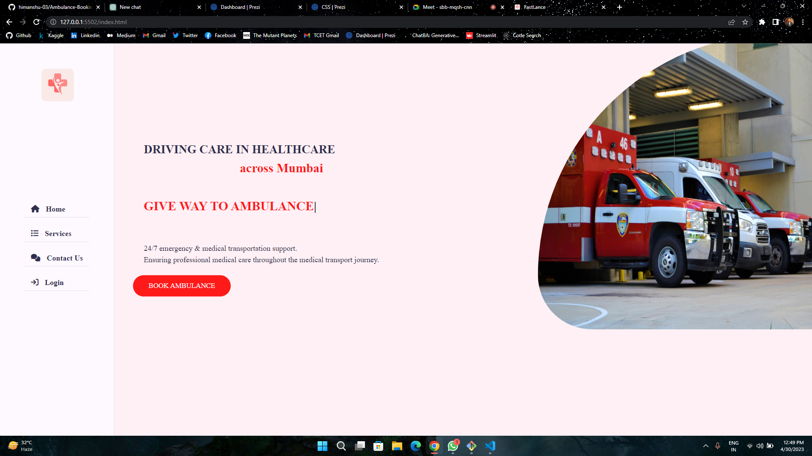
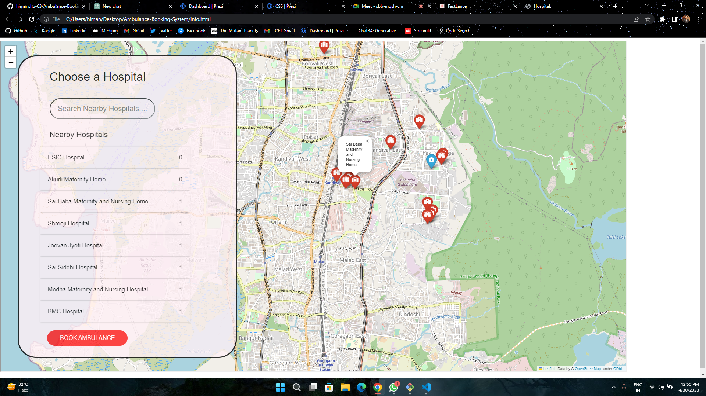

# 🚑 Ambulance-Booking-System

**Fastlance** is built using Python and Flask, and uses a MongoDB Atlas database to store and manage data related to ambulance bookings. The front-end of the application is built using HTML, CSS, and JavaScript, and includes features such as a booking form, a user registration and login system, and an admin panel for managing bookings.
 
<br>

## 👀 Screenshots





<br>

<details>
<summary><h3>⚙️ Execution</h3></summary>

1. Clone our repo

    ```bash
    git clone https://github.com/himanshu-03/Ambulance-Booking-System
    ```

2. Set up a virtual environment

    ```bash
    python -m venv env
    ```

3. Activate the virtual environment

    ```bash
    env\Scripts\activate
    ```

4. Install the dependencies

    ```bash
    pip install -r requirements.txt
    ```

5. Run the FastAPI framework by typing:
    ```bash
    uvicorn main:app --reload
    ```

6. Without closing the Terminal, open a live server for `index.html` and use our application
</details>

<br>

## 🪪 License

You may use this project freely at your own risk. See [LICENSE](https://choosealicense.com/licenses/mit/).

    Copyright (c) 2023 Himanshu Agarwal

<div align="center">
<h3> Connect with me<a href="https://gifyu.com/image/Zy2f"></a>
</h3> 
<p align="center">
    <a href="https://www.linkedin.com/in/agarwal-himanshu" target="_blank"></a> &nbsp&nbsp&nbsp
    <a href="https://www.instagram.com/_._hiimanshu_._" target="_blank"></a> &nbsp&nbsp&nbsp
    <a href="https://www.facebook.com/profile.php?id=100006757421091" target="_blank"></a> &nbsp&nbsp&nbsp
    <a href="mailto:himanshuaaagarwal2002@gmail.com" target="_blank"></a>&nbsp&nbsp&nbsp
    <a href="https://api.whatsapp.com/send/?phone=%2B919967432086&text&type=phone_number&app_absent=0" target="_blank"></a>
    
</p> 
